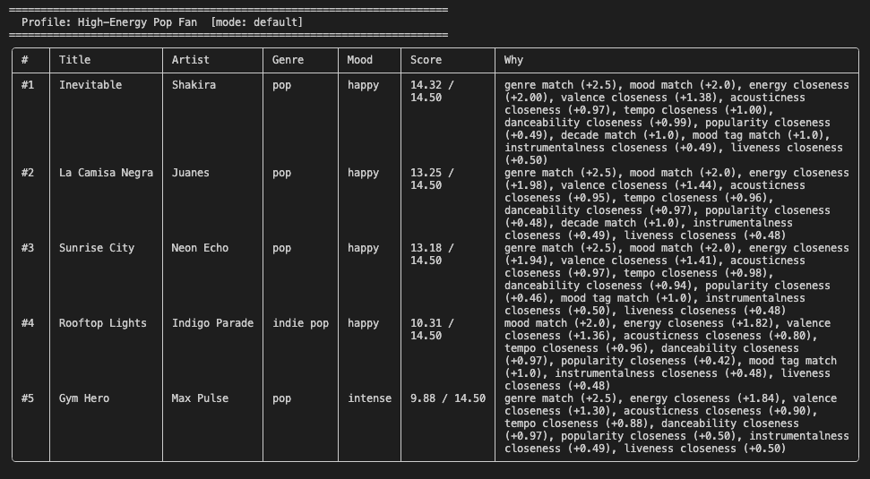
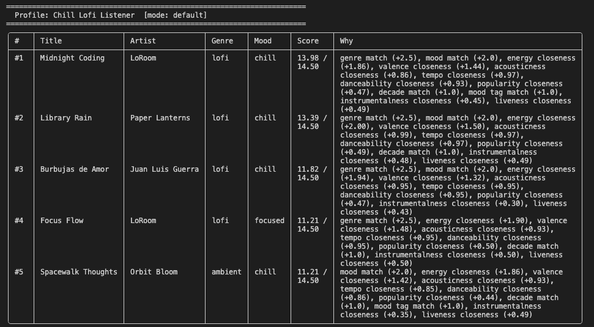
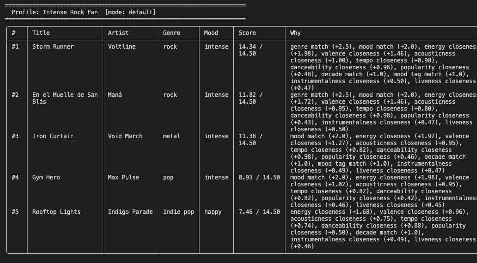
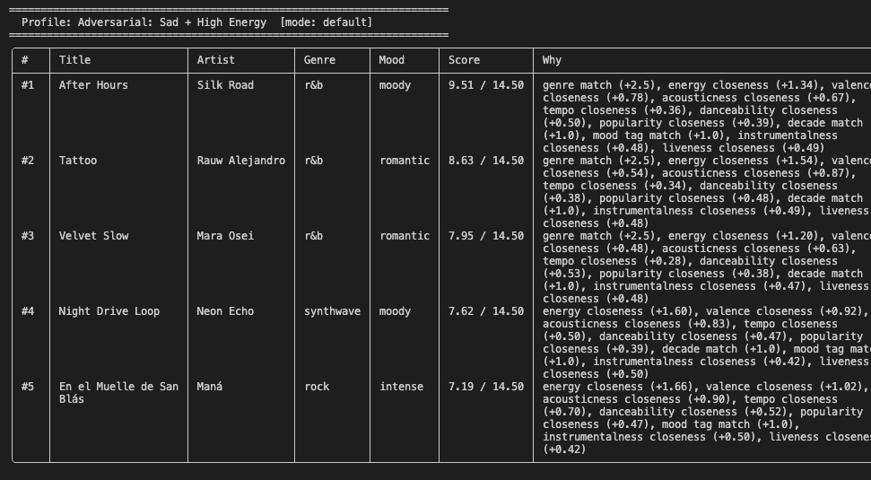

# 🎵 Music Recommender Simulation

## Project Summary

In this project you will build and explain a small music recommender system.

Your goal is to:

- Represent songs and a user "taste profile" as data
- Design a scoring rule that turns that data into recommendations
- Evaluate what your system gets right and wrong
- Reflect on how this mirrors real world AI recommenders

This version builds a content-based music recommender that scores a catalog of 25 songs against a user's taste profile and returns the top 5 matches with plain-language explanations. It supports four user profiles, four scoring modes (default, genre-first, mood-first, energy-focused), and a diversity filter that prevents the same artist or genre from dominating the results.

---

## How The System Works

Music recommenders like Spotify and YouTube use two main strategies: finding users with similar taste and borrowing their history (collaborative filtering) and matching songs by their audio attributes (content-based filtering). My version uses content-based filtering on a catalog of 25 songs. It scores each song by checking if the genre and mood match the user's preferences, then measures how close the song's energy, valence, acousticness, tempo, and danceability are to the user's target values. Songs are ranked by total score and the top results are returned as recommendations. This approach is transparent and explainable — every recommendation comes with a reason — but it won't surprise the user with anything outside their stated preferences.

**`Song` features used:** `genre`, `mood`, `energy`, `valence`, `acousticness`, `tempo_bpm`, `danceability`

**`UserProfile` stores:** `favorite_genre`, `favorite_mood`, `target_energy`, `target_valence`, `target_acousticness`, `target_tempo`, `target_danceability`

### Algorithm Recipe

Each song is scored against the user profile using the following weighted rules. Songs are then sorted by total score (highest to lowest) and the top `k` are returned.

| Signal | Points | Notes |
|---|---|---|
| Genre match | +2.5 | Hardest preference boundary |
| Mood match | +2.0 | Reflects listener's current state |
| Energy closeness | `2.0 × (1 - \|song.energy - target_energy\|)` | Boosted — energy strongly defines feel |
| Valence closeness | `1.5 × (1 - \|song.valence - target_valence\|)` | Emotional positivity |
| Acousticness closeness | `1.0 × (1 - \|song.acousticness - target_acousticness\|)` | Organic vs electronic texture |
| Tempo closeness | `1.0 × (1 - \|song.tempo_bpm - target_tempo\| / 100)` | Normalized over a 100 BPM range |
| Danceability closeness | `1.0 × (1 - \|song.danceability - target_danceability\|)` | Groove and rhythm feel |

**Max possible score: 11.0**

See [assets/diagrams/music_recommender_flow.mmd](assets/diagrams/music_recommender_flow.mmd) for the full data flow diagram.

### Potential Biases

- **Genre dominance:** With genre weighted at 2.5, songs outside the user's preferred genre start at a significant disadvantage — even if every other attribute is a perfect match.
- **Single-point profiles:** Each user is represented as one fixed target per feature. A user who enjoys both high-energy and chill music depending on the moment cannot be accurately represented.
- **Small catalog:** With only 25 songs, some genres and moods have only one or two representatives. This means the top results may repeat the same artists or styles regardless of the user's full profile.

---

## Getting Started

### Setup

1. Create a virtual environment (optional but recommended):

   ```bash
   python -m venv .venv
   source .venv/bin/activate      # Mac or Linux
   .venv\Scripts\activate         # Windows

2. Install dependencies

```bash
pip install -r requirements.txt
```

3. Run the app:

```bash
python -m src.main
```

### Sample Output

**High-Energy Pop Fan**


**Chill Lofi Listener**


**Intense Rock Fan**


**Adversarial: Sad + High Energy**


**Mode & Diversity Comparison**


### Running Tests

Run the starter tests with:

```bash
pytest
```

You can add more tests in `tests/test_recommender.py`.

---

## Experiments You Tried

**Experiment 1 — Mood check removed:** Temporarily commented out the mood match line in `score_song`. Rankings barely changed for any profile. This confirmed that the genre weight (2.5) dominates the ranking, and mood (2.0) is largely redundant when genre already separates the results.

**Experiment 2 — Scoring modes compared:** Ran the High-Energy Pop Fan through all four modes (default, genre-first, mood-first, energy-focused). In `energy-focused` mode, the genre bonus dropped to 0.5 and non-pop songs with high energy started appearing in the top 3 — more variety but less intuitive for a pop-specific user.

**Experiment 3 — Diversity filter on vs. off:** With the diversity filter off, the Pop Fan's top 5 included the same artist twice. With it on, the duplicate was replaced by a different genre song with a slightly lower score. The list felt more like a real playlist.

---

## Limitations and Risks

- **Genre dominates:** A genre match (+2.5) can outweigh near-perfect scores on every other attribute, making the system behave more like a genre filter than a true taste matcher.
- **No "sad" mood in the catalog:** Users who prefer sad music receive zero mood points on every song — a silent failure the output doesn't flag.
- **Small catalog:** 25 songs means some genres and moods have only one representative, so the top results often repeat the same artists.
- **Single fixed profile:** Each user is one static dictionary. Someone who likes both high-energy and chill music depending on the moment cannot be represented.
- **String genre matching:** Sub-genres like "metal" and "rock" are treated as completely different, even when a user would likely enjoy both.

See [model_card.md](model_card.md) for a deeper analysis.

---

## Reflection

Read and complete `model_card.md`:

[**Model Card**](model_card.md)

Building this recommender showed me that the "intelligence" of a recommendation comes entirely from design decisions made before writing any code — which features to include, how much weight to give each one. AI tools helped most during that design phase: I ran multiple chat sessions, got different suggestions for the scoring weights, and built a hybrid recipe from the best ideas across them. The key lesson was to always double-check AI suggestions against the current state of the code, since some were based on an older experimental version and no longer applied.

Testing with diverse profiles revealed where bias quietly enters. The adversarial profile showed that a missing mood in the catalog makes that signal completely useless — the system looks like it's working but silently ignores part of the user's preference. That taught me that fairness in recommender systems is not just about the algorithm — it is equally about what data gets collected and whose tastes are represented.


---

## 7. `model_card_template.md`

Combines reflection and model card framing from the Module 3 guidance. :contentReference[oaicite:2]{index=2}  

```markdown
# 🎧 Model Card - Music Recommender Simulation

## 1. Model Name

Give your recommender a name, for example:

> VibeFinder 1.0

---

## 2. Intended Use

- What is this system trying to do
- Who is it for

Example:

> This model suggests 3 to 5 songs from a small catalog based on a user's preferred genre, mood, and energy level. It is for classroom exploration only, not for real users.

---

## 3. How It Works (Short Explanation)

Describe your scoring logic in plain language.

- What features of each song does it consider
- What information about the user does it use
- How does it turn those into a number

Try to avoid code in this section, treat it like an explanation to a non programmer.

---

## 4. Data

Describe your dataset.

- How many songs are in `data/songs.csv`
- Did you add or remove any songs
- What kinds of genres or moods are represented
- Whose taste does this data mostly reflect

---

## 5. Strengths

Where does your recommender work well

You can think about:
- Situations where the top results "felt right"
- Particular user profiles it served well
- Simplicity or transparency benefits

---

## 6. Limitations and Bias

Where does your recommender struggle

Some prompts:
- Does it ignore some genres or moods
- Does it treat all users as if they have the same taste shape
- Is it biased toward high energy or one genre by default
- How could this be unfair if used in a real product

---

## 7. Evaluation

How did you check your system

Examples:
- You tried multiple user profiles and wrote down whether the results matched your expectations
- You compared your simulation to what a real app like Spotify or YouTube tends to recommend
- You wrote tests for your scoring logic

You do not need a numeric metric, but if you used one, explain what it measures.

---

## 8. Future Work

If you had more time, how would you improve this recommender

Examples:

- Add support for multiple users and "group vibe" recommendations
- Balance diversity of songs instead of always picking the closest match
- Use more features, like tempo ranges or lyric themes

---

## 9. Personal Reflection

A few sentences about what you learned:

- What surprised you about how your system behaved
- How did building this change how you think about real music recommenders
- Where do you think human judgment still matters, even if the model seems "smart"

